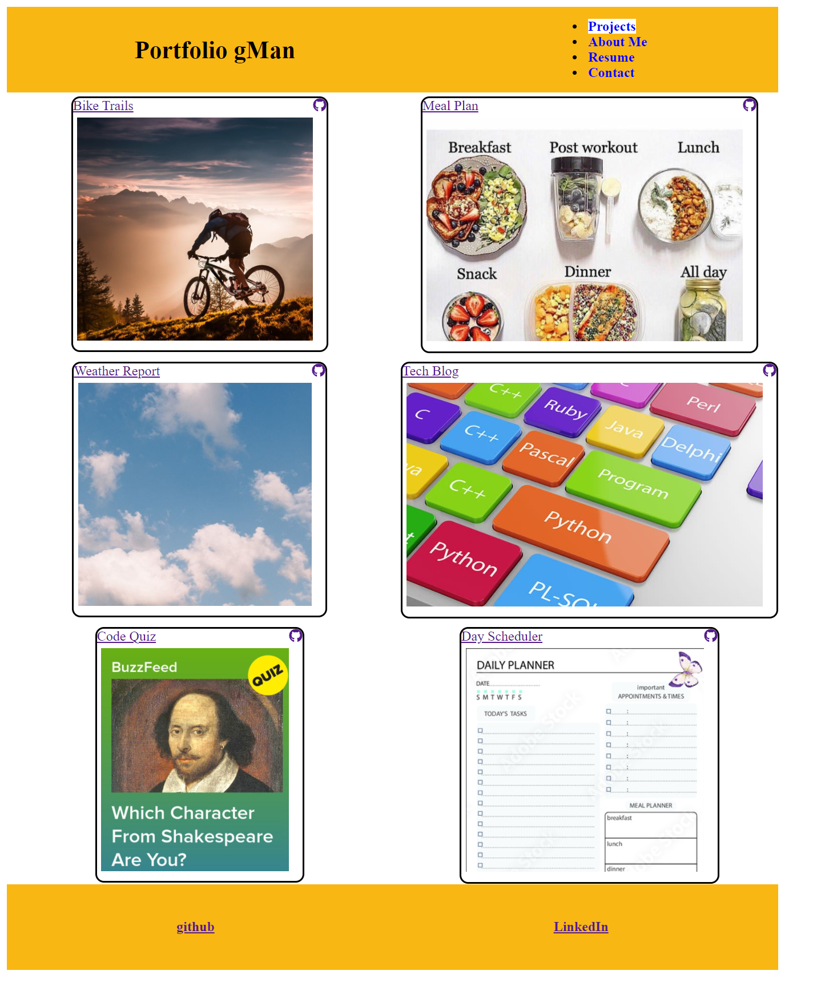

# React-Portfolio 

## Table of Contents
1. [Description](#descrip) 
2. [Installation](#install)
3. [Usage](#usage)
4. [License](#lic)
5. [Contributing](#contri)
6. [Tests](#test)
7. [Questions](#quest)

---------------------------------------
## 1. Description 
My Portfolio of some of the API projects using React technology to display in a single page Web Site.

----------------------------------------------

## 2. Installation 
Installation Instructions: 

Clone repo from github, run 'npm -i' in top directory terminal and then run 'npm start'.  Successful React compiling should automatically open a browser on localhost:3000.

Files used in API found : https://github.com/gmcmurray/React-Portfolio 

API deployed here : https://gmcmurray.github.io/React-Portfolio

-------------------------------------------------

## 3. Usage 
The API is target to be used:
Demonstration of using React technology.

-----------------------------------------------------

## 4. License 

License covering API:
MIT License
    Copyright (c) <2021> <George McMurray>
    Permission is hereby granted, free of charge, to any person obtaining a copy
    of this software and associated documentation files (the "Software"), to deal
    in the Software without restriction, including without limitation the rights
    to use, copy, modify, merge, publish, distribute, sublicense, and/or sell
    copies of the Software, and to permit persons to whom the Software is
    furnished to do so, subject to the following conditions:
    
    The above copyright notice and this permission notice shall be included in all
    copies or substantial portions of the Software.
    
    THE SOFTWARE IS PROVIDED "AS IS", WITHOUT WARRANTY OF ANY KIND, EXPRESS OR
    IMPLIED, INCLUDING BUT NOT LIMITED TO THE WARRANTIES OF MERCHANTABILITY,
    FITNESS FOR A PARTICULAR PURPOSE AND NONINFRINGEMENT. IN NO EVENT SHALL THE
    AUTHORS OR COPYRIGHT HOLDERS BE LIABLE FOR ANY CLAIM, DAMAGES OR OTHER
    LIABILITY, WHETHER IN AN ACTION OF CONTRACT, TORT OR OTHERWISE, ARISING FROM,
    OUT OF OR IN CONNECTION WITH THE SOFTWARE OR THE USE OR OTHER DEALINGS IN THE
    SOFTWARE.

----------------------------------------------

## 5. Contributing 
George McMurray

-------------------------------------------------

## 6. Tests and MockUp
The following tests were conducted on the API:
None in particular.

Screen Shot of Portfolio page rendering.

----------------------------------------------------------------

## 7.  Questions 
For any questions you can email me at:
gmcmurray1493@gmail.com

My github username is gmcmurray

---------------------------------
